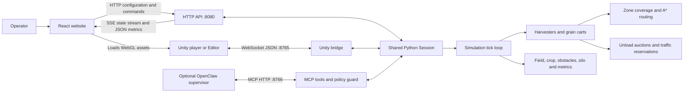
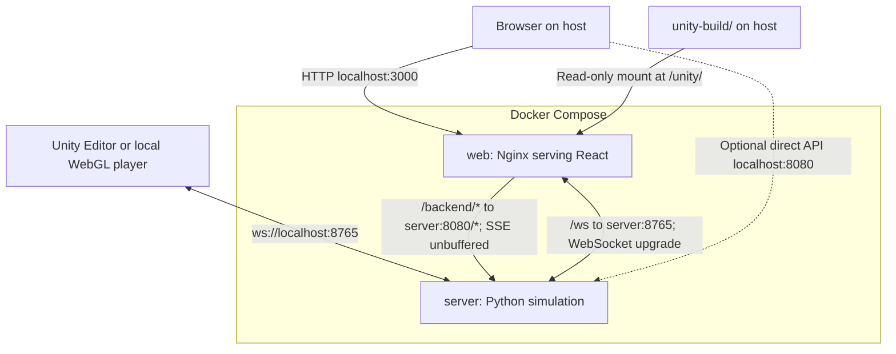

# John Deere Multi-Agent System Integration

A harvest simulation that coordinates autonomous harvesters and grain carts on a
shared field. Harvesters cover assigned zones, request unloading, and deliver grain;
carts bid for requests and transport grain to the silo. The Python engine owns the
world, pathfinding, traffic reservations, machine state, and fuel/harvest metrics.
Unity renders the campaign in 3D, while the React website configures runs, controls
playback, and displays live charts and a field map.

## Repository layout

| Submodule | Responsibility |
| --- | --- |
| [John-Deere-Multi-Agent-System](John-Deere-Multi-Agent-System) | Python engine (`johndeere/`), console/Matplotlib frontends, WebSocket and HTTP/SSE server (`Servidor/`), optional MCP/OpenClaw supervision. |
| [John-Deere-Multi-Agent-Simulation](John-Deere-Multi-Agent-Simulation) | Unity 6000.5.7f1 project: terrain, vehicles, animation, cameras, and NativeWebSocket client. |
| [John-Deere-MultiAgents-Website](John-Deere-MultiAgents-Website) | React 19, Vite 8, Tailwind 4, configuration wizard, metrics dashboard, and embedded Unity WebGL player. |

The root repository supplies Dockerfiles, Nginx configuration, Compose, and `run.sh`.
Unity source is included as a submodule. The compiled `WebDevelopmentTest3` player
is versioned in `unity-build/Build/`; its `.data` and `.wasm` files use Git LFS.

## Architecture



Enabling `--web-port` makes all clients share one run. React sends configuration and
transport commands to `/api/config` and `/api/commands/...`, receives per-tick updates
from `/api/state/stream`, and reads field/history/run data through JSON endpoints.
Unity receives snapshots containing the grid, crop, obstacles, silo, vehicles,
headings, loads, metrics, and tick interval. `WebSocketManager` parses them;
`VehicleManager`, `FieldPainter`, and `GridMove` render and animate them.
The engine runs independently of either client. State and history are in memory.



## Get the project

Install [Git LFS](https://docs.github.com/en/repositories/working-with-files/managing-large-files/installing-git-large-file-storage) first, then:

```bash
git lfs install
git clone --recurse-submodules https://github.com/Fernando94654/John-Deere-Multi-Agent-System-Integration.git
cd John-Deere-Multi-Agent-System-Integration
# For an existing clone:
git submodule update --init --recursive
git lfs pull
```

## Run web and server with Docker

Requirements: Docker Engine or Docker Desktop, Docker Compose with `up --wait`
support, and Bash (on Windows, use WSL). Run from the repository root:

```bash
./run.sh                 # Build images, start services, wait for health checks
./run.sh status          # Show service status
./run.sh logs            # Follow logs; Ctrl-C exits log viewing
./run.sh down            # Stop and remove containers
./run.sh --with-openclaw # Docker services plus a native OpenClaw gateway
```

On Linux/WSL with `python3` and `ss` installed, `run.sh` first stops native Python
servers from `John-Deere-Multi-Agent-System/Servidor/server.py` that occupy the
configured Docker ports, including servers started by `agent/run-demo.sh` or from
another checkout. It sends SIGTERM and waits up to 10 seconds for their listeners
to close; their in-memory run is lost. Other applications and containers are left
alone. If these tools are unavailable, stop conflicting native servers manually.
Port selection respects both shell variables and Compose's root `.env` file.

Open **http://localhost:3000**. The server starts a 16 × 22 field with four
harvesters, two carts, and one second per tick. Use the website's simulation wizard
and transport controls to configure, pause, reset, or start a campaign. The services
run in the background; stopping them discards the in-memory campaign/history.

| Host endpoint | Purpose |
| --- | --- |
| `http://localhost:3000` | React website |
| `http://localhost:3000/backend/api/state` | API through Nginx; used by the Docker website |
| `http://localhost:8080/api/state` | Direct Python API |
| `ws://localhost:8765` | Unity's default WebSocket endpoint |
| `ws://localhost:3000/ws` | WebSocket through Nginx; set this in Unity before building if desired |

Host ports bind to loopback. Override them with environment variables, for example
`WEB_PORT=3001 API_PORT=8081 WS_PORT=8767 ./run.sh`. Use the same variables for later
script commands, or put them in a root `.env` file read by Compose. If changing
`WS_PORT`, update Unity's `serverUrl` accordingly. The website's API connection
continues through Nginx and needs no port adjustment.

The 3D tab uses the included Unity build; the web/server containers do not
compile Unity. Run `git lfs pull` if the binary files contain LFS pointer text.
No Unity installation is needed to run this prebuilt player. For an externally
hosted build, set `VITE_GAME_URL=https://your-host/path/Build` before `./run.sh`;
the image rebuild embeds that URL. The asset host must allow browser cross-origin
requests. Docker overrides Vite's GitHub Pages base path to `/` and uses
`VITE_API_URL=/backend`.

## Run Unity (with either server setup)

1. Install **Unity 6000.5.7f1** through Unity Hub. Add the Web build support module
   if you want to embed the player in the website.
2. Add/open `John-Deere-Multi-Agent-Simulation` in Hub and let its packages import
   (NativeWebSocket is fetched from GitHub).
3. Open **`Assets/Scenes/Presentacion.unity`**, the scene wired to the WebSocket
   server. Select its `WebSocketManager` object and set `serverUrl` to
   `ws://localhost:8765` (or the Nginx endpoint above).
4. Start the server before pressing Play. With `--autostart`, the current campaign
   streams immediately; otherwise use the website or Unity's field-generation UI.

To replace the included Unity build:

1. In Unity Build Profiles, select the Web platform and include `Presentacion`
   as the first scene. The checked-in build scene is `SampleScene`, which uses
   scripted agents and is not the server-connected presentation.
2. In Player Settings, set **Compression Format: Disabled** for this Nginx setup.
3. Export to a directory named **`WebDevelopmentTest3`** so Unity produces the
   filenames currently expected by `Viewer.jsx`. Copy the exported `Build/`
   directory to root `unity-build/Build/`. It must contain:

   ```text
   unity-build/Build/WebDevelopmentTest3.loader.js
   unity-build/Build/WebDevelopmentTest3.data
   unity-build/Build/WebDevelopmentTest3.framework.js
   unity-build/Build/WebDevelopmentTest3.wasm
   ```

4. With Docker, refresh the website: this directory is mounted into Nginx, so no
   image rebuild is needed. The native Vite override below serves the same directory.

Unity's WebSocket URL is serialized into the scene/build; `VITE_GAME_URL` only
changes where React downloads the player assets. `localhost` means the machine
running the browser or Editor. Reload the player/restart Play after changing field
dimensions: the current Unity client creates its grid only on its first snapshot.
Restart the player after a server restart to reconnect.

## Run separately without Docker

Use Python 3.12 and Node.js 24 with npm. Run the following in separate terminals
starting at the repository root.

**Python server:**

```bash
cd John-Deere-Multi-Agent-System
python3 -m venv .venv
source .venv/bin/activate
pip install -r requirements.txt
python Servidor/server.py --host 127.0.0.1 --web-port 8080 --autostart \
  --rows 16 --cols 22 --harvesters 4 --carts 2 --delay 1.0
```

This exposes the API at `http://localhost:8080/api/...` and Unity WebSocket at
`ws://localhost:8765`. Keep `--web-port 8080` when using React so both clients
observe the same world. The React application is served separately below.

**React website:**

```bash
cd John-Deere-MultiAgents-Website
npm ci
VITE_API_URL=http://localhost:8080 \
VITE_GAME_URL=http://localhost:5173/John-Deere-MultiAgents-Website/Build \
  npm run dev -- --host 127.0.0.1 --config ../docker/vite.local.config.mjs
```

Open **http://localhost:5173/John-Deere-MultiAgents-Website/** (or the URL Vite
prints if that port is occupied). The submodule defaults to this GitHub Pages
base path. `VITE_*` variables are consumed at dev-server startup/build time;
restart Vite after changing them.

The Vite override serves `unity-build/` as its public directory, so the embedded
player uses the same LFS assets as Docker. No copying or extra static server is
required. If Vite chooses another port, update `VITE_GAME_URL` accordingly.
Alternatively, use an asset host with CORS enabled.
The Unity Editor can also run alongside the website without exporting WebGL.
Stop native processes with Ctrl-C and stop Unity with its Play button.

**Engine only, without web or Unity:**

```bash
cd John-Deere-Multi-Agent-System
python3 main.py --harvesters 3 --carts 2 --seed 42
# With the virtual environment activated and requirements installed:
python main.py --frontend visual --harvesters 3 --carts 2 --seed 42
```

## Optional OpenClaw supervision

The deterministic harvest agents do not require an LLM. The server also supports
an optional MCP supervisor for inspecting the fleet, rebalancing work, adding carts,
and other commands checked by its policy guard.

### Docker server with native OpenClaw

With OpenClaw installed and configured on your machine:

```bash
./run.sh --with-openclaw
```

This adds `docker/compose.openclaw.yaml`, enables the Docker server's MCP interface
at `http://127.0.0.1:8766/mcp`, and starts OpenClaw **natively on the host**, using
your existing configuration and model login. It follows the gateway setup in
`agent/run-demo.sh` without launching its second Python server. Configure OpenClaw's
`mcp.servers.johndeere` with that URL and `transport: "streamable-http"`, as in the
example configuration. `MCP_PORT` can override the published port; update the
OpenClaw registration to match. The launcher probes this registration after startup.

A healthy existing gateway is reused and left running. Otherwise the launcher
starts one, writes its log to `.runtime/openclaw.log`, and stays in the foreground.
Ctrl-C stops only the gateway it started; Docker stays running until `./run.sh down`.
If gateway startup or the MCP probe fails, the launcher reports failure while leaving
the Docker services available. Use `./run.sh --with-openclaw` for subsequent starts
to retain MCP; plain `./run.sh` selects the web/server-only configuration.

`OPENCLAW_CONFIG_PATH` and `CLAUDE_CONFIG_DIR` may be set in the shell before
launching; the latter defaults to `~/.openclaw/claude-home`, matching `run-demo.sh`.
The root Compose `.env` file configures Docker interpolation, not the native gateway's
environment. No credentials are copied into Docker, and no wake hooks or automatic
model turns are enabled. To request a supervisor turn yourself:

```bash
openclaw agent --agent farm-manager --session-key harvest -m "How is the harvest going?"
```

### Fully native demo

For a configured OpenClaw installation, follow the
[server README](John-Deere-Multi-Agent-System/README.md) and its
[`agent/openclaw.example.json5`](John-Deere-Multi-Agent-System/agent/openclaw.example.json5).
Then, instead of starting a second Python server, run:

```bash
cd John-Deere-Multi-Agent-System
./agent/run-demo.sh --web-port 8080
```

This existing launcher starts OpenClaw and the simulation with MCP on port 8766,
WebSocket on 8765, and the added web API on 8080. It requires local OpenClaw
configuration and model credentials; its token reader expects strict JSON.
Run React and Unity as above. Do not run it alongside the Docker server on the
same ports. Plain `./run.sh` starts web and server without OpenClaw;
no model account or credentials are needed for that path.

## Update the integrated repositories and Unity build

The parent repository pins each submodule to a specific commit. To advance to the
latest configured branches (`main` for server/web, `master` for Unity), first save
any local submodule changes, then run:

```bash
git submodule update --init --recursive --remote --merge
git lfs pull
./run.sh
git add John-Deere-Multi-Agent-System John-Deere-MultiAgents-Website John-Deere-Multi-Agent-Simulation
git commit -m "Update integrated submodules"
```

To version a new player, export it with the filenames listed above, replace the four
files in `unity-build/Build/`, and commit them in this parent repository:

```bash
git add .gitattributes unity-build/Build
git commit -m "Update Unity WebGL build"
git push origin main
```

The Git LFS pre-push hook uploads the binary objects. Keep LFS installed on machines
that publish builds; a clone needs `git lfs pull` if automatic download was skipped.
Changing a submodule pointer does not rebuild the compiled player: export Unity
again when you need newer scene or script changes reflected in the browser.

The updated website also includes fleet recommendations and a chat UI. Those
features depend on the corresponding server support. In particular, the current
chat backend reads a local OpenClaw configuration and connects to host loopback;
its browser-chat path is not yet wired across Docker's network. The native
`agent/run-demo.sh` supports that path; Docker's optional MCP supervisor still works.
